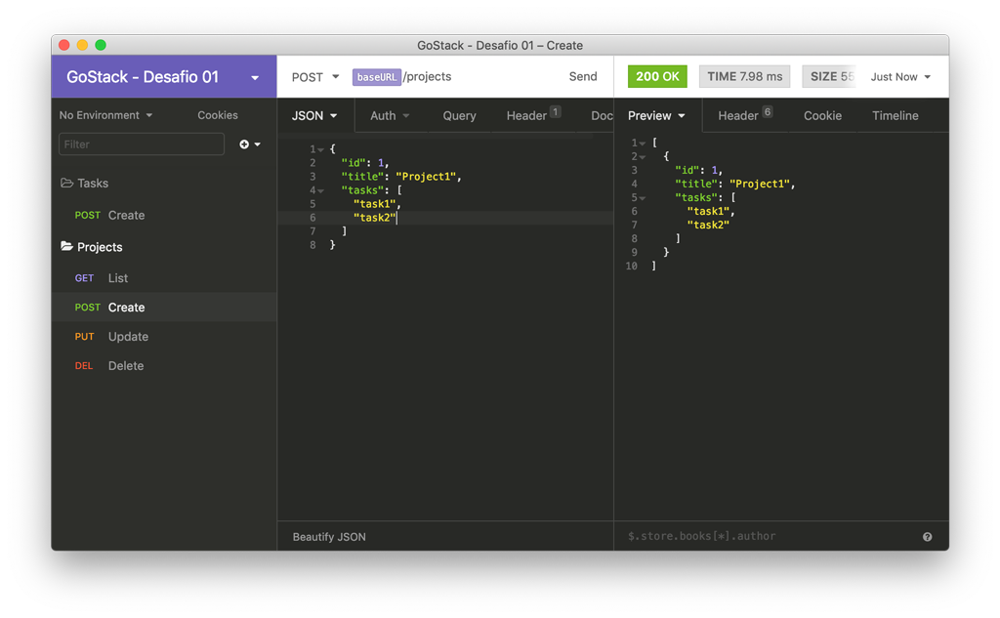
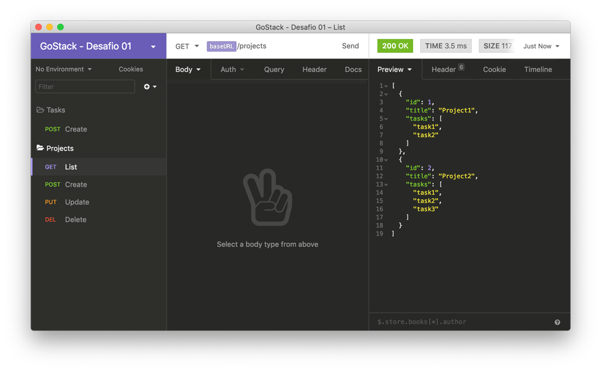
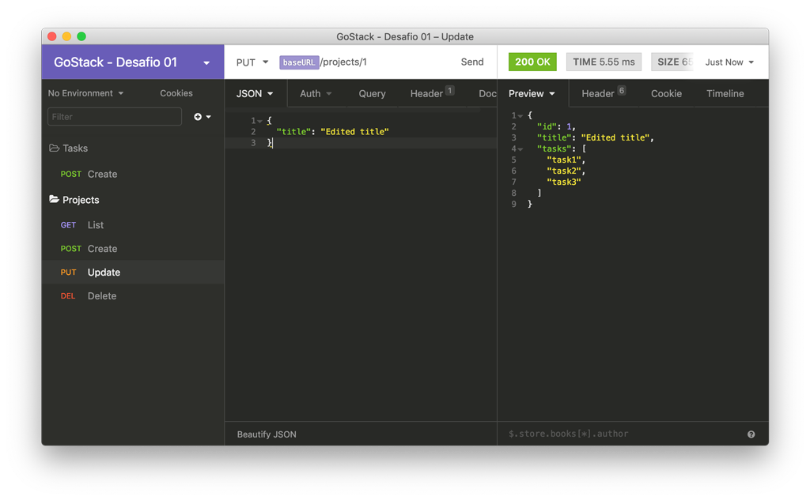
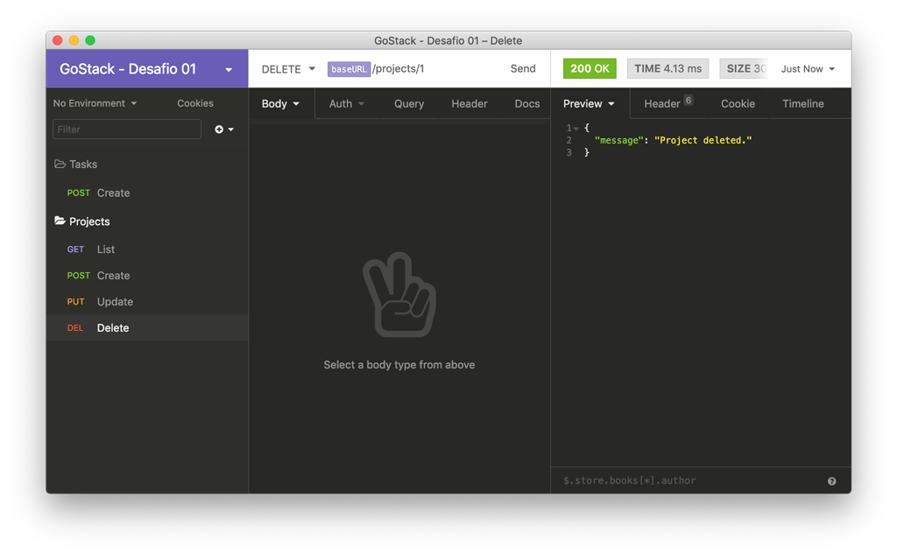
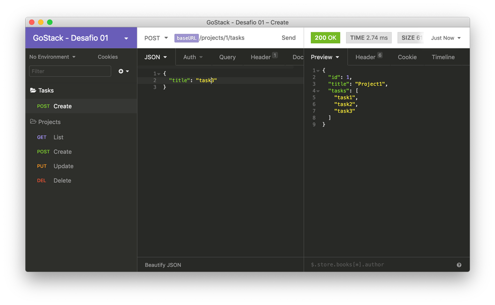

<h1 align="center">
  
</h1>

<h3 align="center">
  Desafio 1: Conceitos do NodeJS
</h3>

## Sobre o desafio

Aplicação criada para o [Desafio 01](https://github.com/rocketseat/bootcamp-gostack-desafio-01) do Bootcamp da Rocketseat.

Aplicação para armazenar projetos e tarefas criada do zero utilizando [Express](https://expressjs.com/pt-br/).

### Rotas

- `POST /projects`: A rota deve receber `id` e `title` dentro do corpo e cadastrar um novo projeto dentro de um array no seguinte formato: `{ id: "1", title: 'Novo projeto', tasks: [] }`;

- `GET /projects`: Rota que lista todos projetos e suas tarefas;

- `PUT /projects/:id`: A rota deve alterar apenas o título do projeto com o `id` presente nos parâmetros da rota;

- `DELETE /projects/:id`: A rota deve deletar o projeto com o `id` presente nos parâmetros da rota;

- `POST /projects/:id/tasks`: A rota deve receber um campo `title` e armazenar uma nova tarefa no array de tarefas de um projeto específico escolhido através do `id` presente nos parâmetros da rota;

## Licença

Esse projeto está sob a licença MIT. Veja o arquivo [LICENSE](LICENSE) para mais detalhes.
