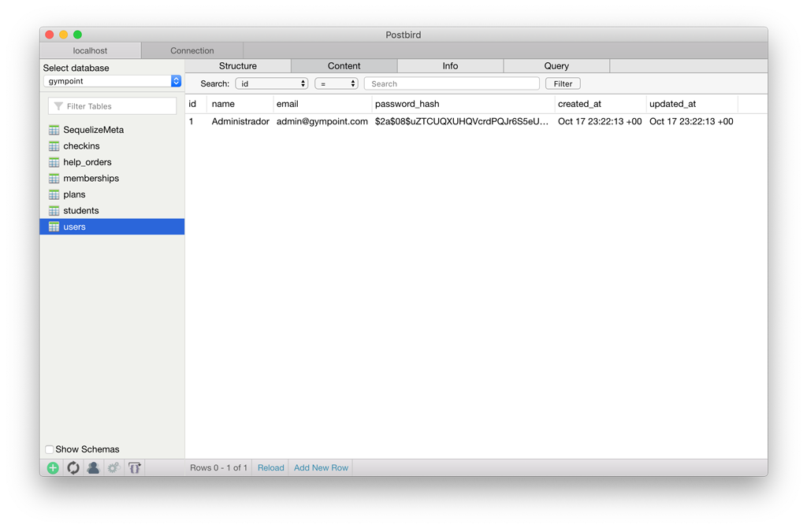
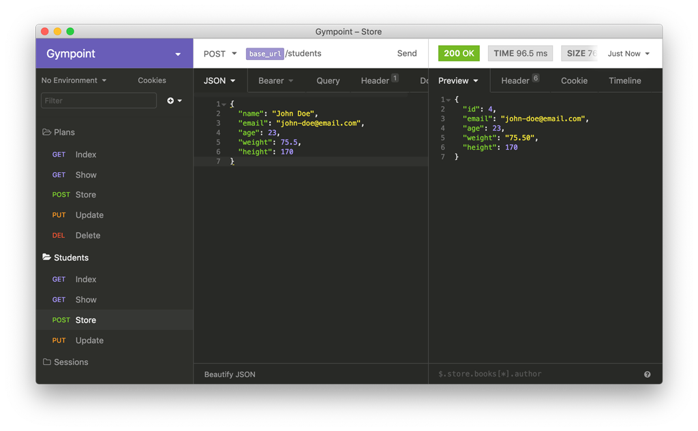

<h1 align="center">
  
</h1>

<h3 align="center">
  Desafio 2: Gympoint, o início
</h3>

## Sobre o desafio

Gympoint: App Gerenciador de Academia.

Aplicação criada para o [Desafio 02](https://github.com/rocketseat/bootcamp-gostack-desafio-02) do Bootcamp da Rocketseat.

### Um pouco sobre as ferramentas

Aplicação criada do zero utilizando [Express](https://expressjs.com/), além de precisar configurar as seguintes ferramentas:

- Sucrase + Nodemon;
- ESLint + Prettier + EditorConfig;
- Sequelize (com PostgreSQL);

### Funcionalidades

#### 1. Autenticação

Permite que um usuário se autentique em sua aplicação utilizando e-mail e uma senha.

Esse primeiro usuário, por ser um administrador único, foi criado utilizando um seed.

Agora você tem um usuário na sua base de dados, utilize esse usuário para todos logins daqui pra frente.

- A autenticação deve ser feita utilizando JWT.
- Realize a validação dos dados de entrada;

#### 2. Cadastro de alunos

Alunos são mantidos (cadastrados/atualizados) na aplicação utilizando nome, email, idade, peso e altura.

O cadastro de alunos só pode ser feito por administradores autenticados na aplicação.

O aluno não pode se autenticar no sistema, ou seja, não possui senha.

## Licença

Esse projeto está sob a licença MIT. Veja o arquivo [LICENSE](LICENSE) para mais detalhes.
