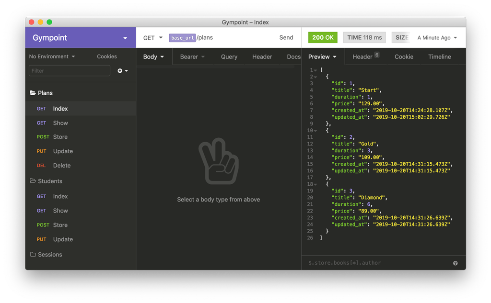
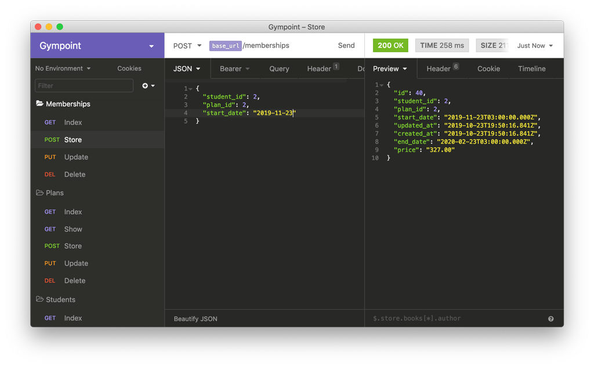
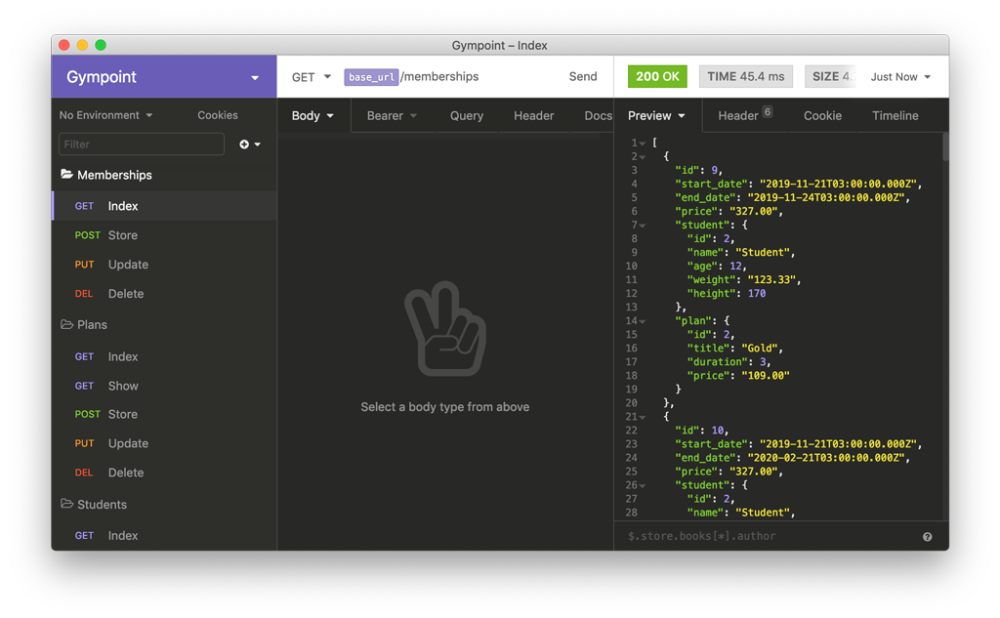
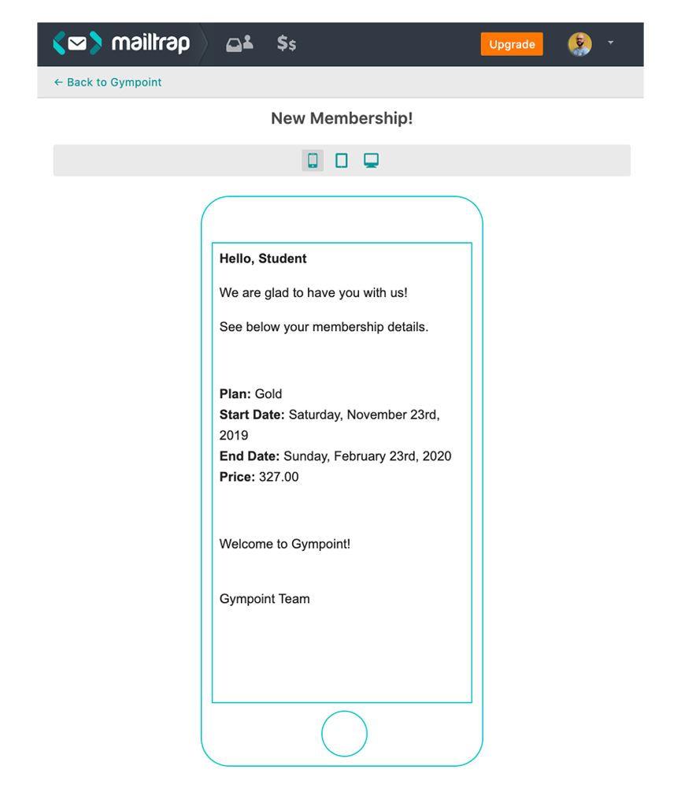
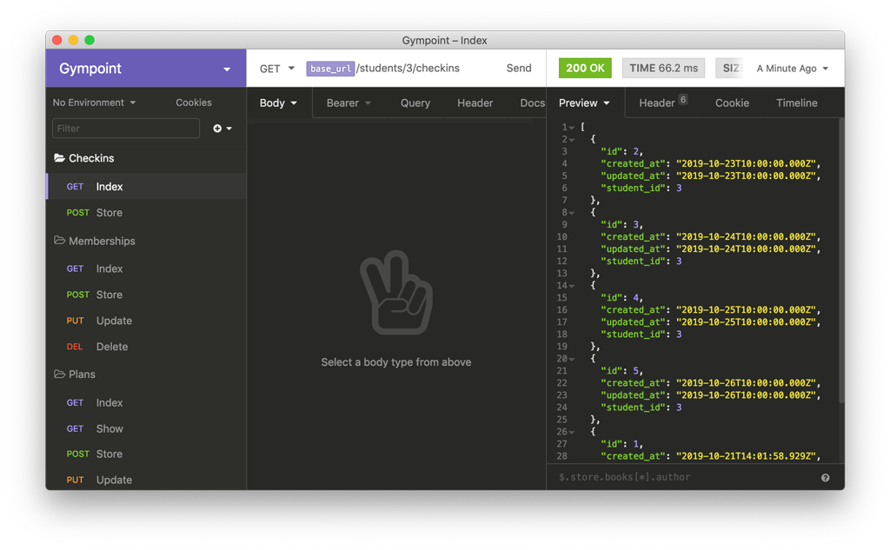
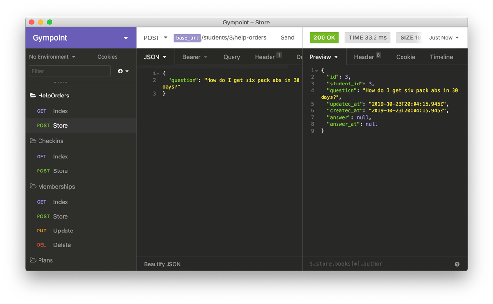
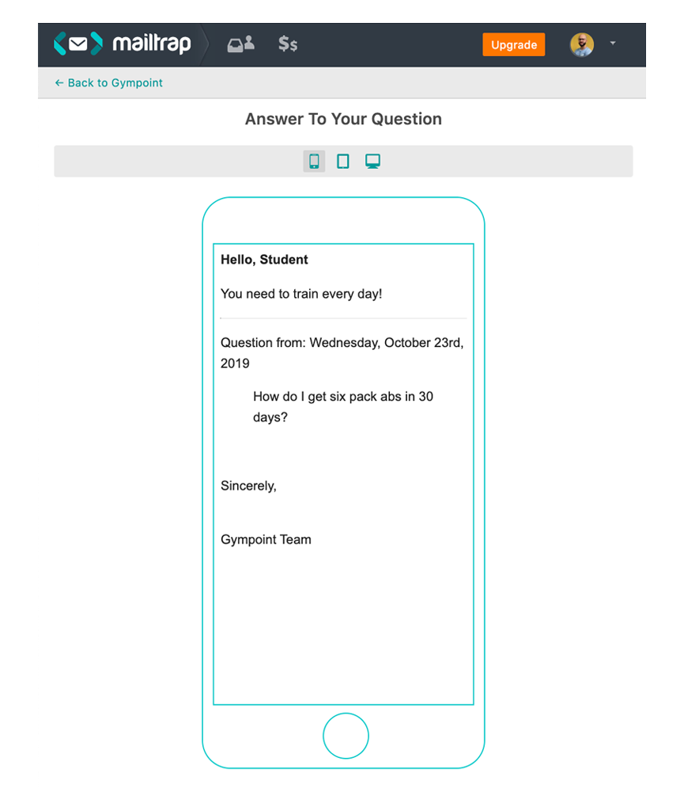

<h1 align="center">
  
</h1>

<h3 align="center">
  Desafio 3: Gympoint, continuando a aplicação
</h3>

## Sobre o desafio

Aplicação criada para o [Desafio 03](https://github.com/rocketseat/bootcamp-gostack-desafio-03) do Bootcamp da Rocketseat.

### Funcionalidades do administrador

#### 1. Gestão de planos

O usuário administrador pode adicionar planos com os seguintes campos:

- title (nome do plano);
- duration (duração em número de meses);
- price (preço mensal do plano);
- created_at;
- updated_at;

Exemplos:

- `Start`: Plano de 1 mês por R\$129;
- `Gold`: Plano de 3 meses por R\$109/mês;
- `Diamond`: Plano de 6 meses por R\$89/mês;

#### 2. Gestão de matrículas

Cadastro de matrículas por aluno. A matrícula possui os campos:

- student_id (referência ao aluno);
- plan_id (referência ao plano);
- start_date (data de início da matrícula);
- end_date (date de término da matrícula);
- price (preço total calculado na data da matrícula);
- created_at;
- updated_at;

Quando um aluno **realiza uma matrícula** ele recebe um e-mail com detalhes da sua inscrição na academia como plano, data de término, valor e uma mensagem de boas-vidas.

### Funcionalidades do aluno

#### 1. Checkins

Quando o aluno chega na academia o mesmo realiza um check-in apenas informando seu ID de cadastro (ID do banco de dados);

Esse check-in serve para monitorar quantas vezes o usuário frequentou a academia na semana.

A tabela de `checkins` possui os campos:

- student_id (referência ao aluno);
- created_at;
- updated_at;

#### 2. Pedidos de auxílio

O aluno pode criar pedidos de auxílio para a academia em relação a algum exercício, alimentação ou instrução qualquer;

A tabela `help_orders` deve conter os seguintes campos:

- student_id (referência ao aluno);
- question (pergunta do aluno em texto);
- answer (resposta da academia em texto);
- answer_at (data da resposta da academia);
- created_at;
- updated_at;

Quando um pedido de auxílio for respondido, o aluno recebe um e-mail da plataforma com a pergunta e resposta da academia.

## Licença

Esse projeto está sob a licença MIT. Veja o arquivo [LICENSE](LICENSE) para mais detalhes.
