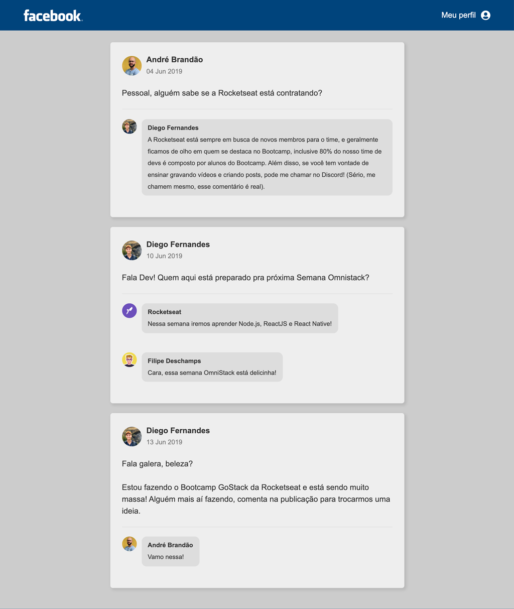

<h1 align="center">
  
</h1>

<h3 align="center">
  Desafio 4: Introdução ao React
</h3>

## Sobre o desafio

Aplicação criada para o [Desafio 04](https://github.com/Rocketseat/bootcamp-gostack-desafio-04) do Bootcamp da Rocketseat.

A **interface** semelhante ao **Facebook** foi criada utilizando **React**.

Foi utilizado também **Webpack, Babel e Webpack Dev Server**. As informações contidas são **estáticas**.

### Tela da aplicação

## Licença

Esse projeto está sob a licença MIT. Veja o arquivo [LICENSE](LICENSE) para mais detalhes.
