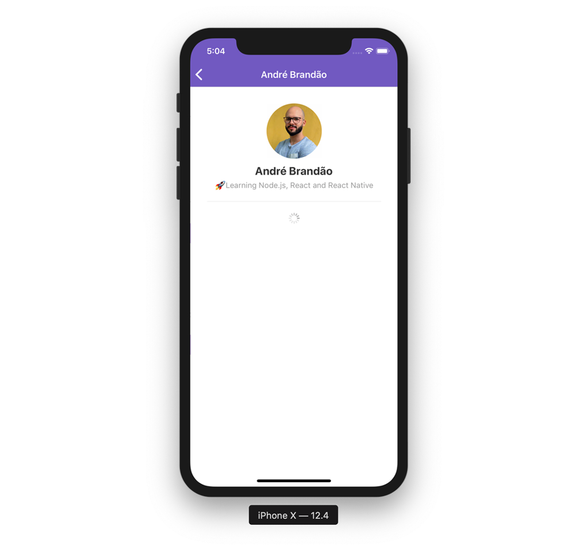
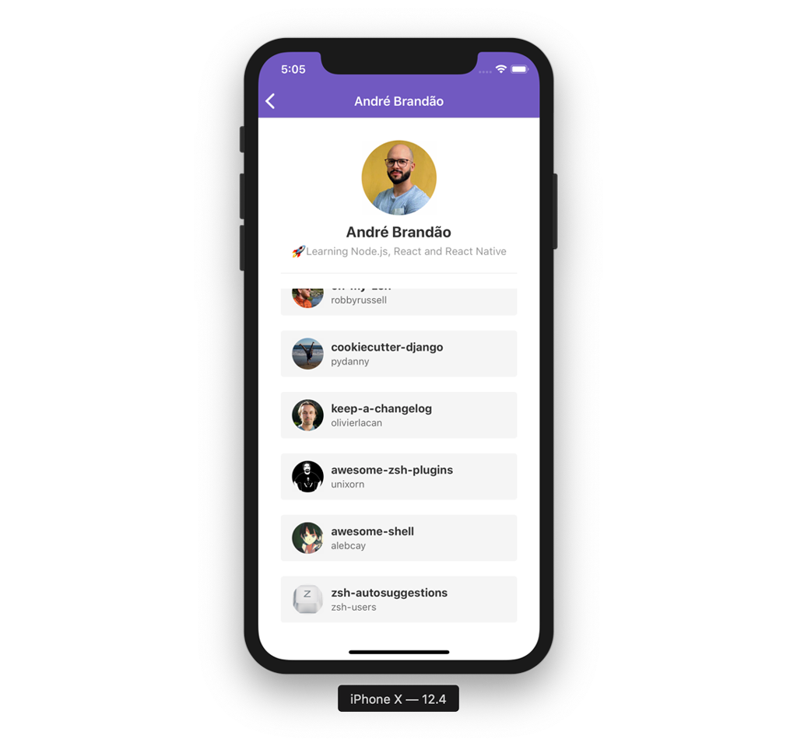
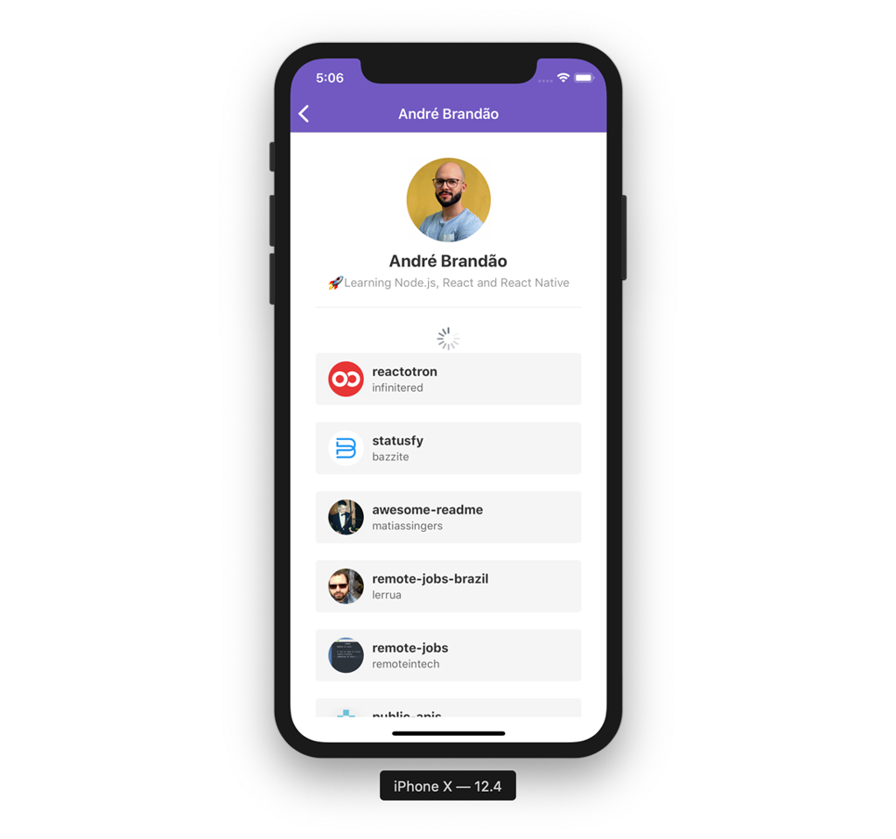
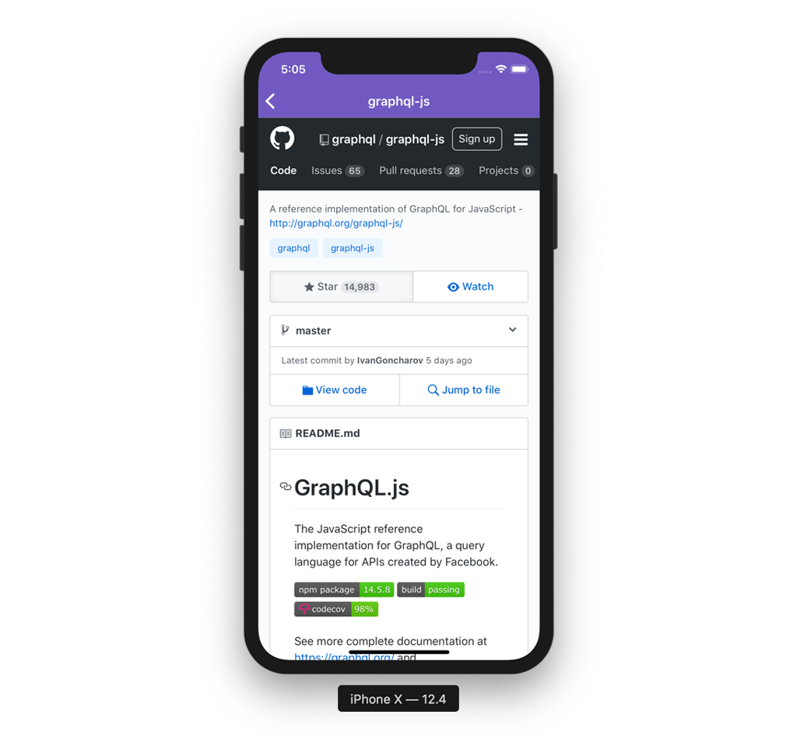

<h1 align="center">
  
</h1>

<h3 align="center">
  Desafio 6: Primeiro projeto com React Native
</h3>

## Sobre o desafio

Aplicação criada para o [Desafio 06](https://github.com/Rocketseat/bootcamp-gostack-desafio-06) do Bootcamp da Rocketseat.

### Funcionalidades

#### 1. Loading de repositórios

Adicionado um indicator de loading utilizando `<ActivityIndicator />` antes de carregar a lista de repositórios favoritados na tela de detalhes do Usuário.

  

#### 2. Scroll infinito

Adicionada uma funcionalidade de scroll infinito na lista de repositórios favoritados. Assim que o usuário chegar nos **20%** do final de lista, items da próxima página são buscados e adicionados na lista.

  

#### 3. Pull to Refresh

Adicionada uma funcionalidade para quando o usuário arrastar a listagem de repositórios favoritados pra baixo atualizar a lista resetando o estado, ou seja, volta-se ao estado da paginação para a página 1 exibindo apenas os 30 primeiros itens.

  

#### 4. WebView

Criada uma nova página na aplicação que é acessada quando o usuário clica em um repositório favoritado.

  

## Licença

Esse projeto está sob a licença MIT. Veja o arquivo [LICENSE](LICENSE) para mais detalhes.
