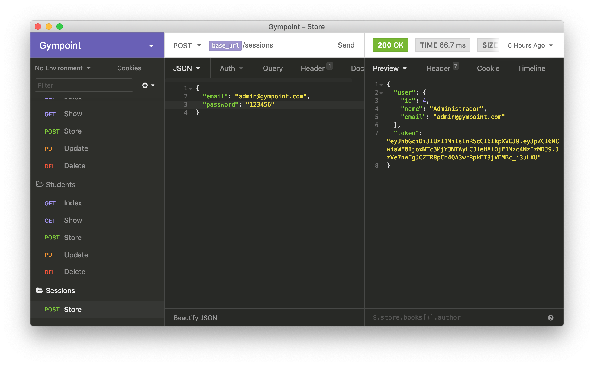
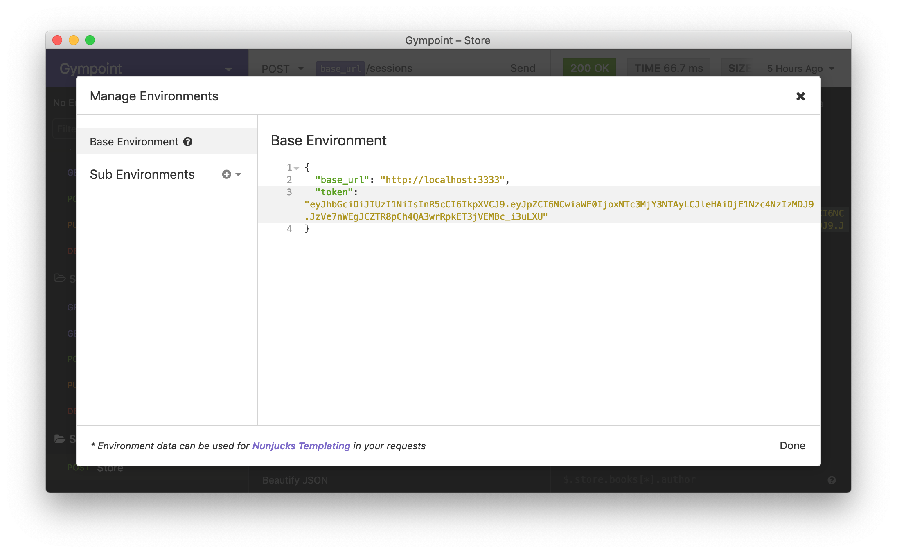
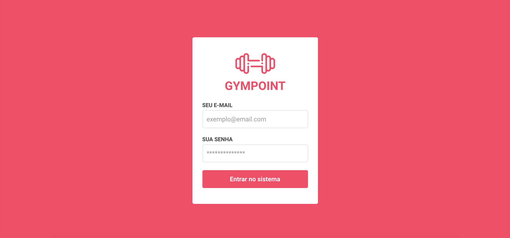

<h1 align="center">
  
</h1>

<h3 align="center">
  Desafio Final: Gympoint
</h3>

## Sobre o desafio

Projeto criado durante o Bootcamp GoStack #9 da [Rocketseat](https://rocketseat.com.br). A aplicação foi desenvolvida em um Macbook e testada na versão mobile somente para iOS.

## Instalação e execução

Primeiro, faça um clone desse repositório e entre na pasta rodando `cd bootcamp-gostack-gympoint`. 

### Backend

1. Entre na pasta do backend rodando `cd backend`
2. Rode `yarn` para instalar as dependências
3. Renomeie o arquivo `.env.example` para `.env` e coloque as credenciais referentes ao BD utilizado, Redis e Email. O arquivo já tem alguns dados preenchidos como exemplo.
4. Execute as seeds do projeto com `yarn sequelize db:seed:all`
5. Rode `yarn dev` para executar o servidor backend
6. Rode `yarn queue` para executar a fila que enviará os emails

O Admin criado na aplicação tem usuário `admin@gympoint.com` e senha `123456`. Utilize essas credenciais para logar na aplicação web.

Para fazer chamadas à API diretamente, importe o arquivo [insomnia.json](insomnia.json) na aplicação [Insomnia](https://insomnia.rest/). Ele já conterá exemplos de chamadas. 

Você precisará criar uma session com o usuário `admin@gympoint.com` e utilizar o `token` retornado nas chamadas. Faça essas configurações nas variávels de ambiente do Insomnia.

  

  

### Frontend

1. Entre na pasta rodando `cd frontend`
2. Rode `yarn` para instalar as dependências
3. Rode `yarn start` para executar a aplicação web
4. Faça o login com o usuário `admin@gympoint.com` e senha `123456`

  

### Mobile

**PS: A aplicação foi desenvolvida e testada somente para iOS.**

1. Entre na pasta rodando `cd mobile`
2. Rode `yarn` para instalar as dependências
3. Instale o [CocoaPods](https://cocoapods.org/), entre na pasta `ios` e rode `pod install`
4. Volta à pasta anterior e rode `yarn ios`
5. Faça o login com o id de um dos usuários criados. Utilize o `id: 1` caso seu banco de dados só tenha sido criado uma vez.

  

### Extras

1. Instale o [Insomnia](https://insomnia.rest/) para fazer chamadas REST à API
2. Instale o [Reactotron](https://infinite.red/reactotron) para debugar as chamadas e estados na Web e Mobile
3. Instale o [Postbird](https://electronjs.org/apps/postbird) para ver as tabelas no banco de dados
4. Instale o [Docker](https://www.docker.com/) para executar o banco de dados PostgreSQL e o Redis em containers

## Licença

Esse projeto está sob a licença MIT. Veja o arquivo [LICENSE](LICENSE) para mais detalhes.
